# Credit Risk Analysis — End-to-End Data Analytics Project


---

## Why I Built This Project

After completing my first portfolio project on Amazon and Walmart
sales data, I wanted to work on something more challenging and
closer to the finance domain I am targeting. Credit risk is one
of the most real and high-stakes problems in banking — banks lose
money when customers default, and they need data to make smarter
lending decisions.

So I took a dataset of 32,581 loan applications from Kaggle and
asked one simple question: **which customers are most likely to
default, and why?**

I worked through the entire pipeline — Excel for cleaning, SQL
for analysis, Python for deeper exploration and a basic ML model,
and Power BI for the final dashboard. This took several weeks and
taught me more than any course.

---

## What I Found

These were the findings that surprised me or stood out the most:

- Grade G loans default at **98.44%** — almost every single one
  fails. When I first saw this number I thought I had made an
  error. I ran the query three times. It was correct.

- The **60+ age group** has the highest default rate at 24.3% —
  not the youngest group as I initially assumed. The data
  corrected my assumption.

- Customers with **less than 1 year of employment** default at
  36.7%. Employment stability matters more than I expected.

- Low income customers default at **47.07%** — nearly 1 in 2
  loans fail in this segment.

- My ML model predicted default with **~80% accuracy** using
  just 10 features. The strongest predictor was loan percent
  of income — how much of their salary someone is borrowing.

---

## Tools Used

| Tool | What I Used It For |
|---|---|
| Excel 2019 | Cleaned raw data, handled missing values, created 7 derived columns |
| SQL Server SSMS | Wrote 24 queries from basic to advanced |
| Python Google Colab | EDA, 7 charts, correlation analysis, ML model |
| Power BI 2.155 | 4-page interactive finance dashboard, 13 DAX measures |

---

## Project Files

| File | Description |
|---|---|
| `Credit_Risk_Analysis.xlsx` | Excel cleaning and pivot analysis |
| `Credit_Risk_SQL_Analysis.sql` | All SQL queries — basic to advanced |
| `Credit_Risk_EDA.ipynb` | Python Notebook 1 — Exploratory Data Analysis |
| `Credit_Risk_Visualization.ipynb` | Python Notebook 2 — 7 charts |
| `Credit_Risk_Feature_Analysis.ipynb` | Python Notebook 3 — correlation and feature ranking |
| `Credit_Risk_ML_Model.ipynb` | Python Notebook 4 — Logistic Regression model |
| `Credit_Risk_Analysis_Dashboard.pbix` | Power BI 4-page dashboard |

---

## Dataset

- **Source:** Kaggle — Credit Risk Dataset
- **Size:** 32,581 rows, 12 original columns
- **Target variable:** loan_status (0 = repaid, 1 = defaulted)

The dataset covers loan applicants with details like age, income,
employment length, loan amount, interest rate, loan grade, and
whether they had defaulted before.

---

## Phase 1 — Excel

The raw data had missing values in two columns —
`person_emp_length` and `loan_int_rate`. I filled both with
their median values rather than mean because median is less
affected by extreme outliers, which this dataset had (some ages
showing as 144 years for example).

I created 7 new columns that did not exist in the original data:

| Column | What It Means |
|---|---|
| age_flag | Flags ages above 85 as potential outliers |
| income_flag | Flags incomes above 500,000 for review |
| risk_category | Groups grades into Low, Medium, High, Extreme Risk |
| income_band | Splits income into Low, Medium, High, Very High |
| debt_burden | Classifies loan weight relative to income |
| default_label | Converts 0 and 1 into readable text |
| repeat_defaulter | Combines current and past default into 4 segments |

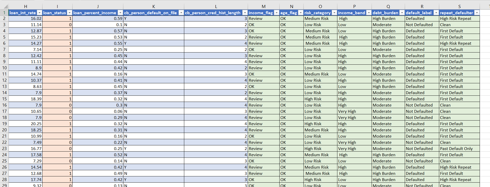

---

## Phase 2 — SQL

I imported the cleaned data into SQL Server and wrote queries
across 4 levels of complexity.

**Total queries written: 26**

| Level | Queries | Skills |
|---|---|---|
| Basic | 5 | SELECT, WHERE, COUNT, TOP |
| Intermediate | 10 | GROUP BY, HAVING, CASE WHEN |
| Advanced | 9 | CTE, RANK, LAG, PARTITION BY, NTILE, ROW_NUMBER |

The query I am most proud of is the bank recommendation table.
It uses two CTEs chained with RANK() and CASE WHEN to produce
a direct business output — Grade G = Avoid, Grade A = Acceptable:

```sql
WITH GradeRisk AS (
   SELECT loan_grade,
     COUNT(*) AS Total_Loans,
     CAST(SUM(loan_status) * 100.0 / COUNT(*) AS DECIMAL(5,2)) AS Default_Rate_Pct
   FROM credit_risk
GROUP BY loan_grade
),
GradeRanked AS (
     SELECT *,
      RANK() OVER (ORDER BY Default_Rate_Pct DESC) AS Risk_Rank,
      CASE
         WHEN Default_Rate_Pct >= 30 THEN 'Avoid'
         WHEN Default_Rate_Pct >= 15 THEN 'Caution'
         ELSE 'Acceptable'
      END AS Bank_Recommendation
     FROM GradeRisk
)
SELECT * FROM GradeRanked ORDER BY Risk_Rank;
```

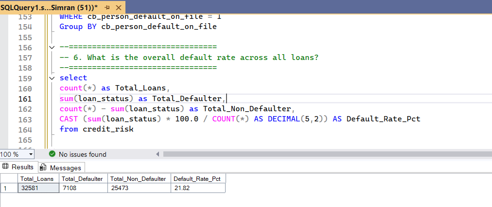

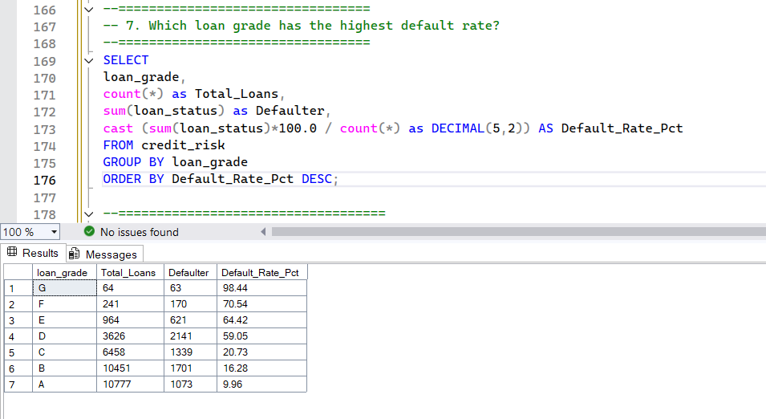

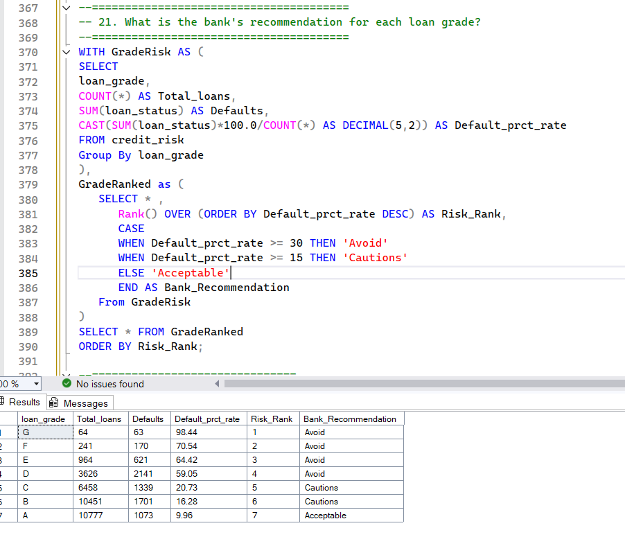

---

## Phase 3 — Python

I want to be upfront — Python is something I am still learning.
This was my first time writing Python for a real project, and I
built everything in Google Colab across 4 structured notebooks.
Every cell has comments explaining what the code does and why.

**Notebook 1 — EDA**
Basic profiling — shape, data types, missing values, overall
default rate calculation.

**Notebook 2 — Visualization**
7 charts covering default rate by grade, loan intent, income
band, age group, and a correlation heatmap. The heatmap was
the most useful — it showed at a glance which factors actually
relate to default.

**Notebook 3 — Feature Analysis**
Ranked every numeric column by how strongly it correlates with
default. loan_percent_income came out strongest, followed by
loan_int_rate. This finding later showed up in the ML model
feature importance too — consistent across both methods.

**Notebook 4 — ML Model**
Built a Logistic Regression model using Scikit-learn:
- 10 features selected based on correlation analysis
- Text columns encoded using LabelEncoder
- All features scaled using StandardScaler
- 80% training / 20% testing split
- **~80% accuracy on unseen test data**
- Built a single customer predictor — input their details,
  get a default probability percentage

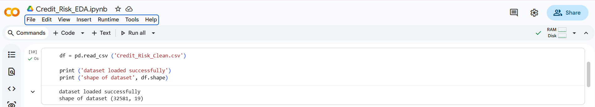

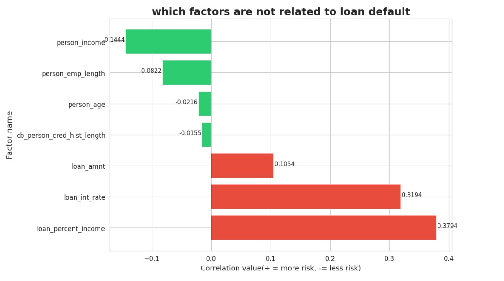

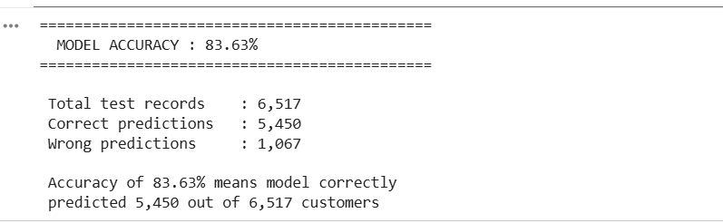

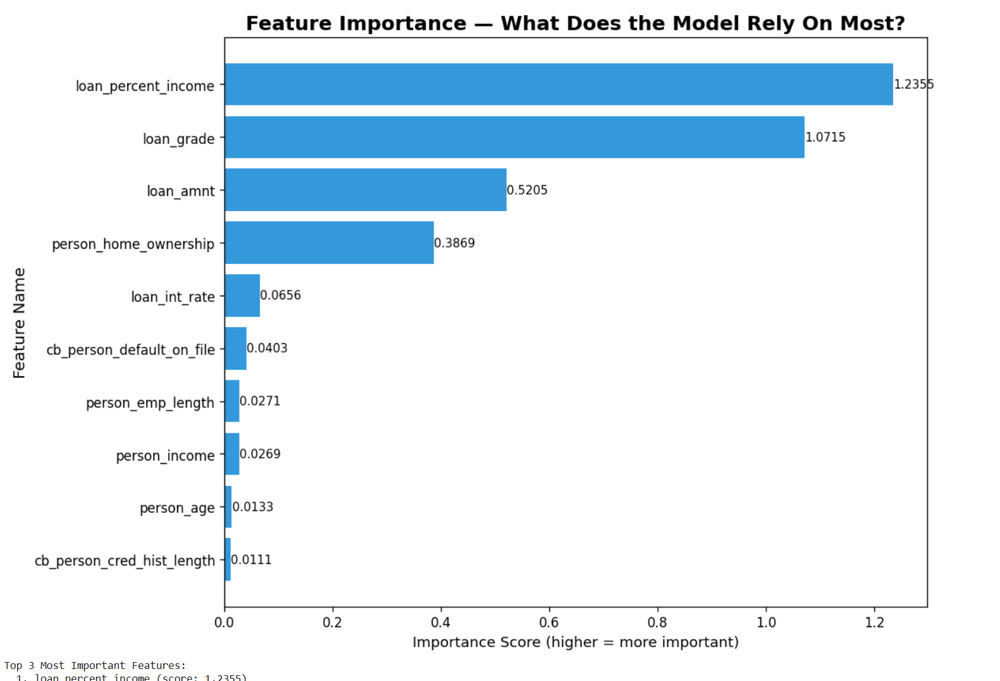

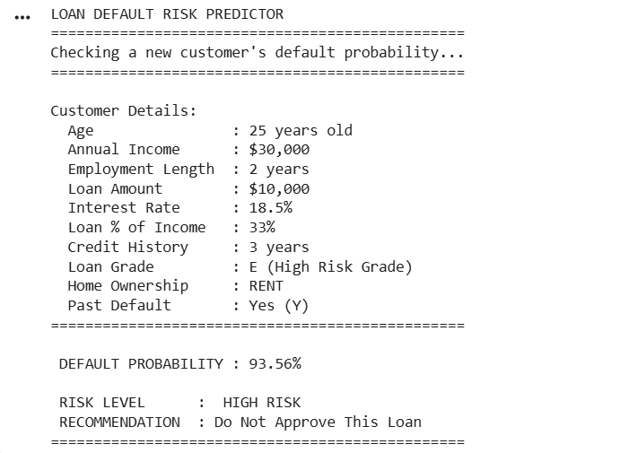

---

## Phase 4 — Power BI Dashboard

The dashboard connects directly to SQL Server rather than the
Excel file — so the data flows through the complete pipeline:
Excel → SQL → Power BI.

**Pages: 4 | DAX Measures: 13 | Theme: Dark Navy Finance**

**Page 1 — Risk Overview**
Five KPI cards, gradient bar chart for loan grade risk, 100%
stacked bar for default split, horizontal bar for loan intent,
grade risk table with conditional formatting, and a key insights
panel.

**Page 2 — Customer Profile**
Age band column chart, default rate line chart by age, income
band analysis, home ownership donut. The 60+ finding is visible
immediately in the line chart.

**Page 3 — Loan Analysis**
Loan amount band analysis proves bigger loans default more.
Debt burden analysis uses the derived column created in Excel.

**Page 4 — High Risk Deep Dive**
Focused on Grade E, F, G customers. The column chart showing
Grade G at 98% is the most visually dramatic thing in this
project. Employment length analysis shows less than 1 year
employment customers default at 36.7%.

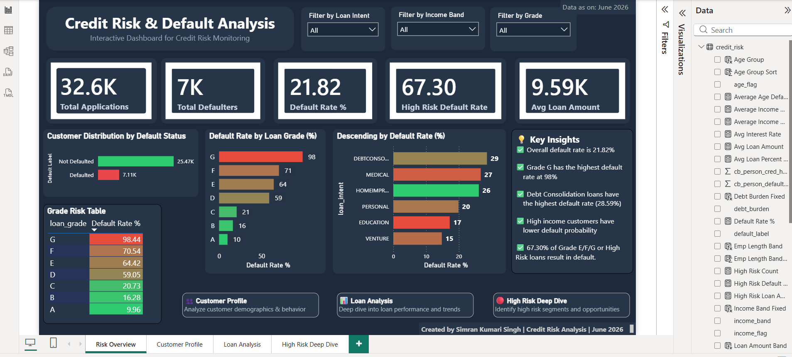

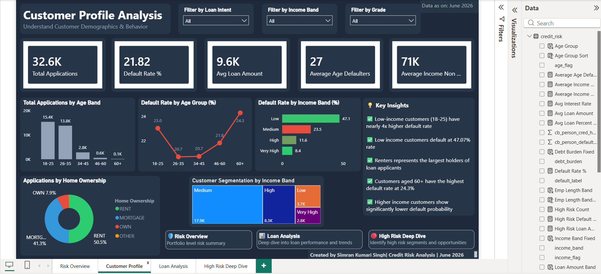

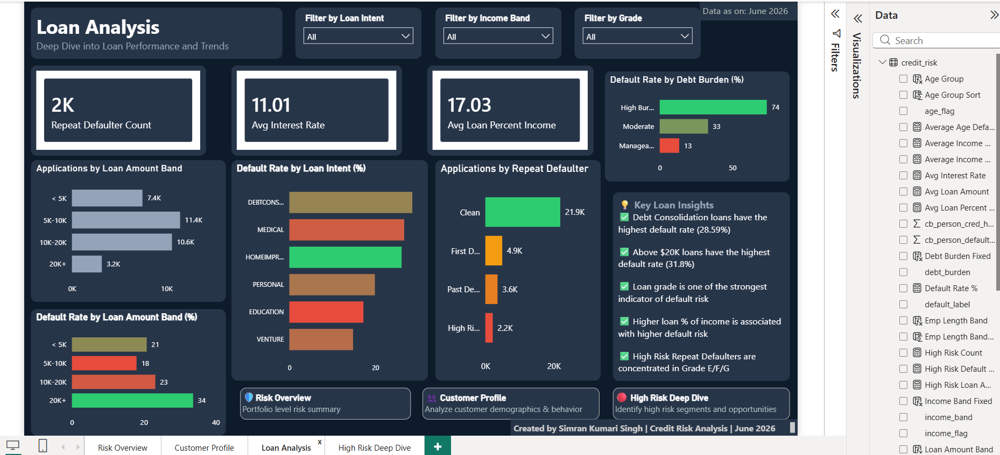

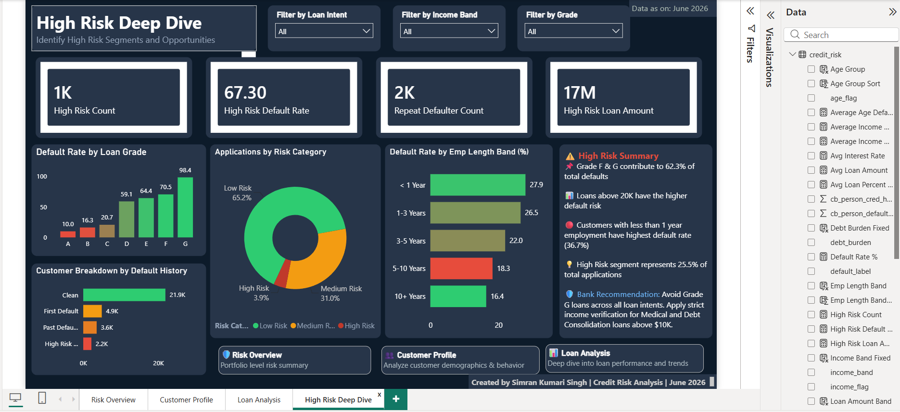

---

## What I Would Tell a Bank

If someone from a bank or credit firm asked me what to do with
these findings:

- Stop approving Grade G loans. 98% default rate is not a
  risk — it is a certainty.
- Debt Consolidation loans need stricter income verification.
  They default most often across all loan purposes.
- Any applicant with less than 1 year of employment should
  trigger a manual review regardless of their grade.
- High Burden customers — those borrowing more than 40% of
  their income — are significantly more likely to default.
  Set a hard cap.
- Grade A customers are safe. Fast-track them.

---

## How to Reproduce This Project

1. Download dataset from Kaggle:
   [Credit Risk Dataset](https://www.kaggle.com/datasets/laotse/credit-risk-dataset)
2. Open `Credit_Risk_Analysis.xlsx` for cleaning reference
3. Import cleaned CSV into SQL Server and run
   `Credit_Risk_SQL_Analysis.sql`
4. Open notebooks in Google Colab from the `03_Python` files
5. Open `Credit_Risk_Analysis_Dashboard.pbix` in Power BI
   Desktop and reconnect to your local SQL Server

---

## About Me

I am Simran Kumari Singh — a B.Com Honours graduate from
Kolkata transitioning into data analytics. I completed the
Google Professional Data Analytics Certificate and have been
building my portfolio with real datasets and end-to-end projects.

This is my second portfolio project. My first was an
[Amazon and Walmart Sales Analysis](https://github.com/Simran29-hue/Amazon-Walmart-Sales-Analysis)
using the same Excel → SQL → Power BI stack.

I am currently looking for entry-level Data Analyst, Business
Analyst, or MIS Executive roles — preferably in the finance
domain.

**Google Data Analytics Certificate**
Credential ID: 4JCF6A0KEQBP

[](https://linkedin.com/in/simran-kumari-singh-029n02y)
[](https://github.com/Simran29-hue)

---

*Created by Simran Kumari Singh | Credit Risk Analysis | June 2026*
